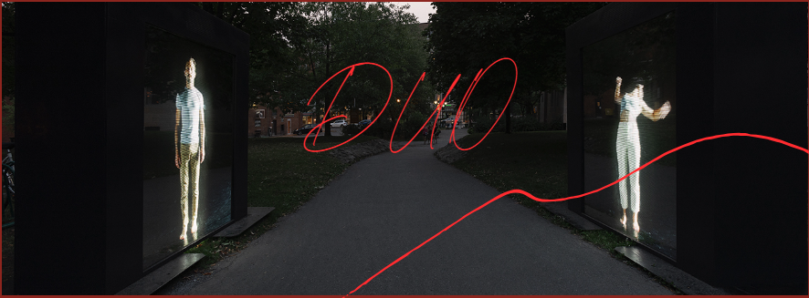
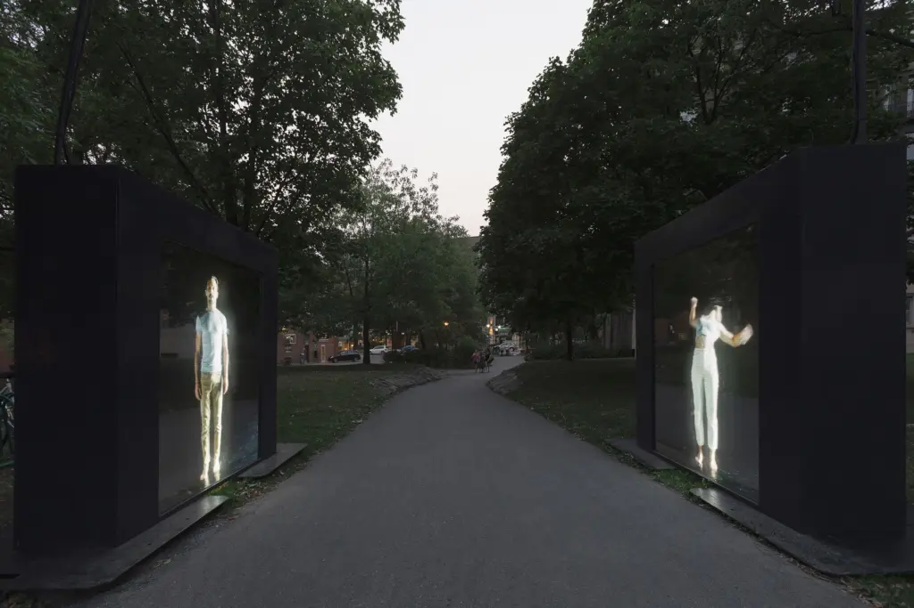
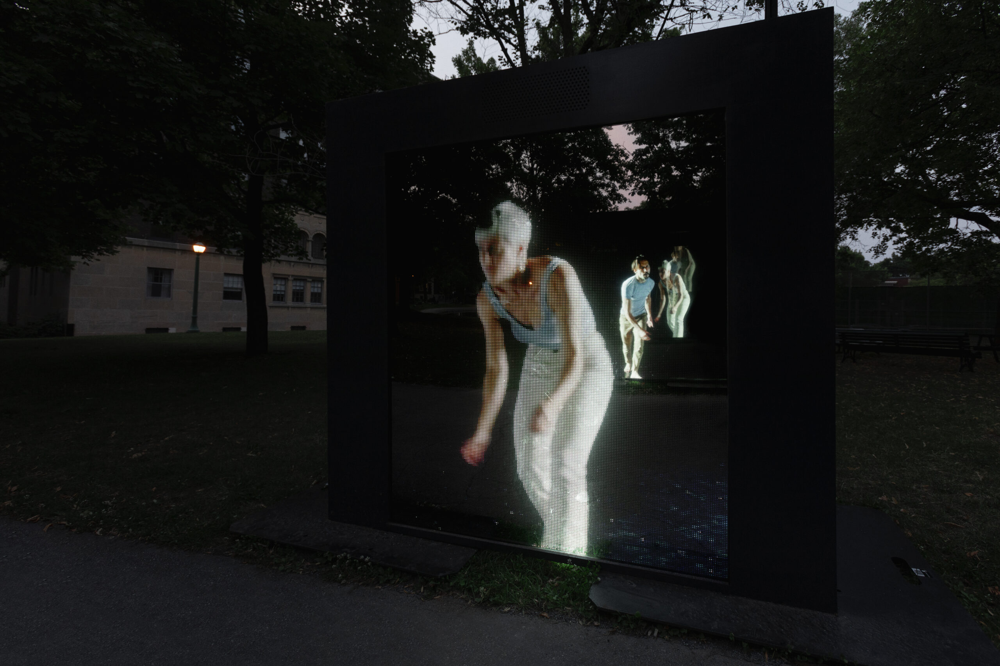

# DUO

## Compagnie
**mirari**

* Installation transforme perception du public
* Art vecteur de changement
* Rencontre unique avec les spectateur(rice)s

## Équipe
* Direction de création : Thomas Payette (mirari)
* Chorégraphie : Virginie Brunelle (Compagnie Virginie Brunelle)
* Danse : Sophie Breton et Milan Panet-Gigon
* Scénographie : Xavier Mary (mirari)
* Conception et réalisation multimédia : Antonin Gougeon Moisan (mirari)
* Direction technique : Jean-François Piché
* Contenu et réalisation des images : mirari
* Construction : Gauvin Fabrique

## Collaboration
Virginie Brunelle

* créé la chorégraphie

## Financement
Ville de Montréal

## Creation
* 2020
* Première : 2 octobre 2020
* Présenter le 26 août 2024

## Présentation
* Lieu : Le Parterre, Quartier des spectacles
Extérieur
* Fait pour tout personne qui la voie
* Autre lieu : square Sir-George-Étienne-Cartier arrondissment Le Sud-Ouest

## Description

* Installation interactive

## Objectifs de l'oeuvre

* Permettre des duo en publique
* Faire participer l'auditioir

## Publique

Toute personne qui ce presente entre les deux denseurs.

## Aspects Techniques

* Vidéo - son (haut-parleur) - mirroire

## Processus de création 

* Corrégraphie créé par danseur

## Composante centrale 

* 2 écrans led avec 2 miroirs sans tain - fonctionnement - impact
* Musique : Dear Criminals

## Apréciation

* interactivité
* union
