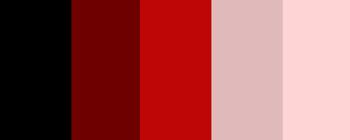
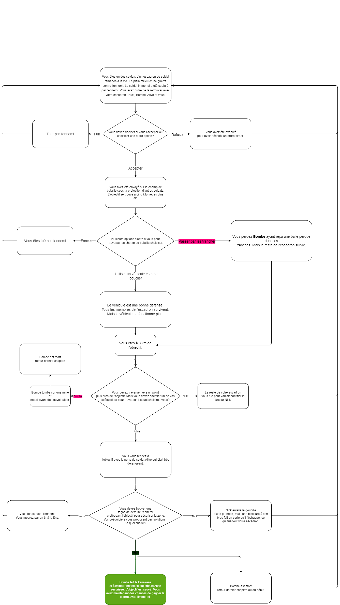

[Dévelopement Web - Projet Vous êtes le heros](https://github.com/victorgileau/Gileau-Victor_Vous-etes-le-heros_Escadron-des-morts/tree/main)

**Genre** : Guerre, drame, surnaturel

**Inspiration** : Save private ryan, art de Massiveface sur instagram

**Palette de couleur :**  [coolor.co](https://coolors.co/palette/000000-6e0000-9c0505-bf0606-e0baba)

Première version palette de couleur en dessous :

### Schéma - Histoire de L'Escardon des morts

